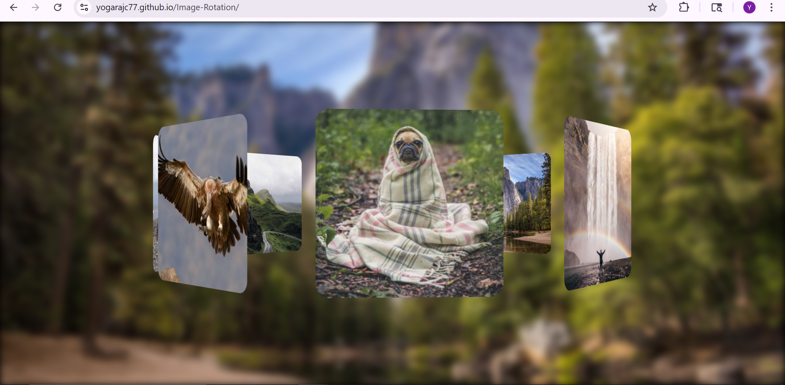

#  Image Rotation Project

A simple and interactive web application that allows users to rotate images dynamically using JavaScript. This project demonstrates DOM manipulation, event handling, and basic frontend development skills.

---

##  Live Demo

https://yogarajc77.github.io/Image-Rotation/

---

##  Features

* Rotate images with button controls
* Smooth and responsive UI
* Lightweight and fast performance
* Beginner-friendly project structure

---

##  Technologies Used

* HTML5
* CSS3
* JavaScript (Vanilla JS)

---

##  Project Structure

Image-Rotation

─ index.html
─ style.css
─ script.js

---

##  How It Works

* The image is displayed on the webpage
* JavaScript is used to apply rotation using CSS transform
* Each button click rotates the image by a specific degree

---

##  Learning Outcomes

* DOM Manipulation
* Event Handling in JavaScript
* CSS Transformations
* Basic Project Structuring

---

##  Screenshot

 

---

##  Author

**Yogaraj C**

* GitHub: 

-- https://github.com/yogarajc77

##  Acknowledgement

This project is created for learning and improving frontend development skills.

---

##  Future Improvements

* Add rotation animation effects
* Allow custom rotation input
* Make mobile UI more interactive

---
